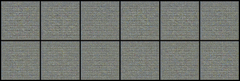

# TinyGAN

Tiny, readable PyTorch Lightning GAN template — DCGAN-style generator + spectral-norm discriminator. A compact starter to design and scale up GAN models.

## What’s inside

* `tiny_celeba_gan_spectral_norm.py` — single-file training script
* Checkpointing for generator & critic (`state_dict()`), optional optimizer files
* Hinge loss, manual optimization, TensorBoard logging, saves on epoch end + SIGINT

## Demo

**Training example:** `100_epochs_training_results.gif` (included).




## Quick start

1. Download CelebA-HQ and put it at the repo root as `celeba_hq` (Kaggle):
   [https://www.kaggle.com/lamsimon/celebahq](https://www.kaggle.com/lamsimon/celebahq)
2. Run:

```bash
python tiny_celeba_gan_spectral_norm.py --image_size 64 --batch_size 128 --max_epochs 50 --save_dir ./outputs --tb_logdir ./logs
```

3. View samples in `./outputs` and open TensorBoard:

```bash
tensorboard --logdir logs
```

## Notes

* Default checkpoint paths: `drive/MyDrive/model/*.pth` — override with `--gen_checkpoint` / `--crit_checkpoint`.
* Use `--load_optimizers` / `--save_optimizers` to restore/save optimizer state dicts (separate files).
* Script attempts to load the generator checkpoint at startup; edit if you prefer to start fresh.

## License

MIT — free to use and extend.
